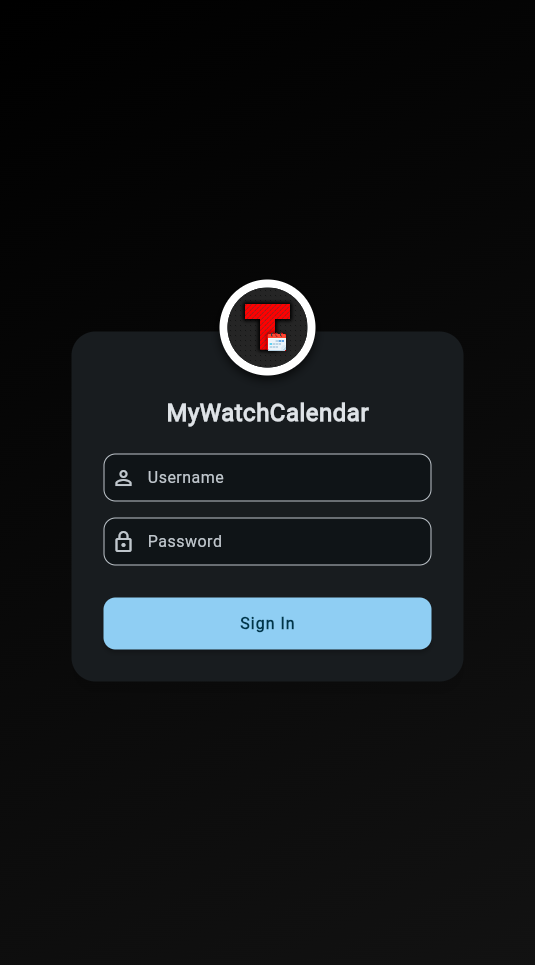
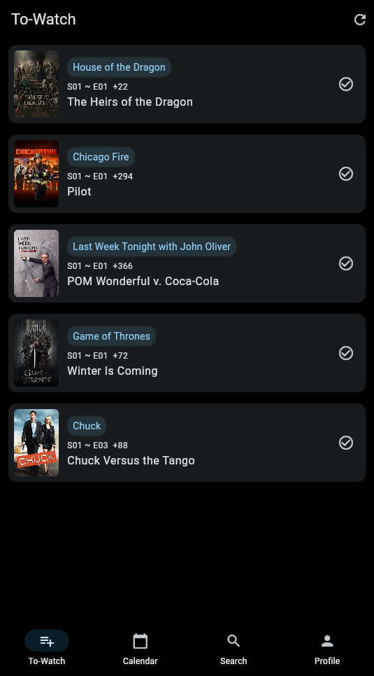
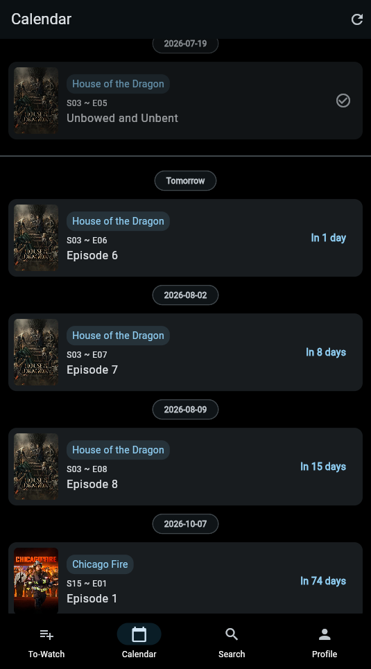
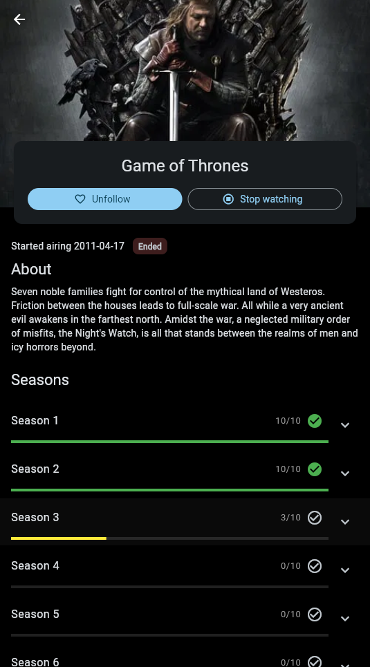
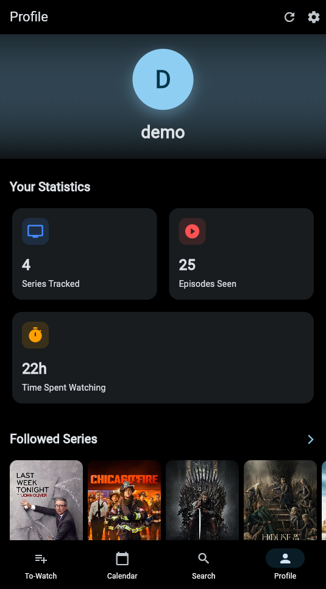
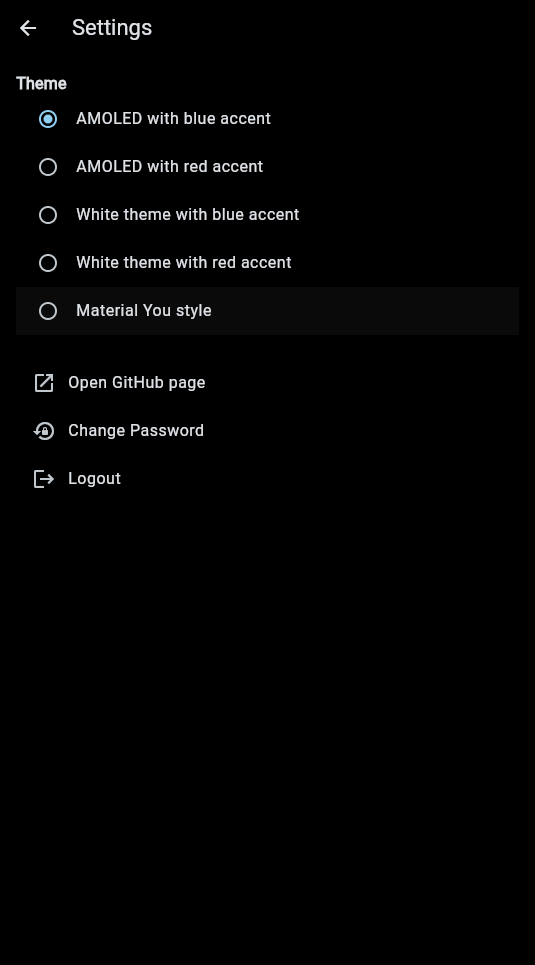

# MyWatchCalendar

This is an app made to replicate in a self-hosted environment what [TVTime](https://tvtime.com/) used to do in a semplified way. Has the essential To-watch, calendar and search. The backend is available [here](https://github.com/seanwlk/mywatchcalendar-server).

## Stuff to know

- Written in Flutter
- Configurable Backend Endpoint
- Few basic themes were implemented
- Has a To-Watch widget for the homescreen (kinda working, i found out that Dose kills it so it works only when you open the app and it automatically force refreshes the widget... Google stuff...)

## Gallery

  
  
  
  
  
  

